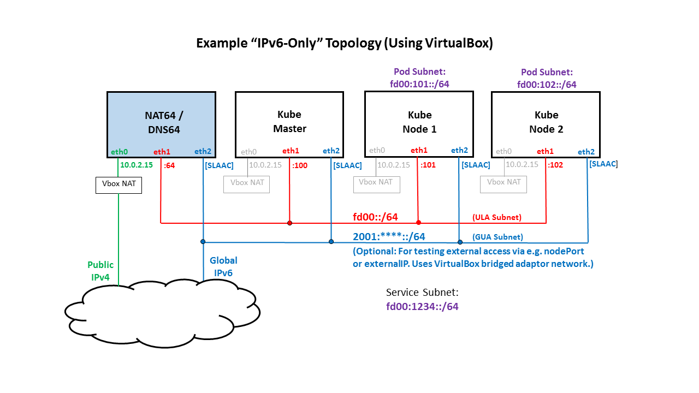

# kube-v6
Instructions on how to instantiate a multi-node, IPv6-only Kubernetes cluster using the CNI bridge plugin and Host-local IPAM plugin for developing or exploring IPv6 on Kubernetes.

# Overview
So you'd like to take Kubernetes IPv6 for a test drive, or perhaps do some Kubernetes IPv6 development? The instructions below describe how to bring up a multi-node, IPv6-only Kubernetes cluster that uses the CNI bridge and host-local IPAM plugins, using kubeadm to stand up the cluster.

For instructional purposes, the steps below assume the topology shown in the following diagram, but certainly various topologies can be supported (e.g. using baremetal nodes or different IPv6 addressing schemes) with slight variations in the steps:



# Quick Start Options
If you would like to get a sense of how what IPv6-only support looks like on Kubernetes, here are a couple of quick-start options:

 * Docker run an IPv6-only cluster in a "Kube-in-the-Box" container, using commands described [here](https://github.com/leblancd/kube-in-the-box).
 * Use the automated Vagrant environment. You will need to [install Vagrant](https://www.vagrantup.com/downloads.html), and then run `./vagrant-start` from the [vagrant directory](vagrant).

# FAQs

#### Why Use the CNI Bridge Plugin? Isn't it intended for single-node clusters?
The Container Networking Interface (CNI) [Release v0.6.0](https://github.com/containernetworking/plugins/releases/tag/v0.6.0) included support for IPv6 operation for the Bridge plugin and Host-local IPAM plugin. It was therefore considered a good reference plugin with which to test IPv6 changes that were being made to Kubernetes. Although the bridge plugin is intended for single-node operation (the bridge on each node is isolated), a multi-node cluster using the bridge plugin
can be instantiated using a couple of manual steps:

 * Provide each node with a unique pod address space (e.g. each node gets a unique /64 subnet for pod addresses).
 * Add static routes on each node to other nodes' pod subnets using the target node's host address as a next hop.

#### Why run in IPv6-only mode rather than running in dual-stack mode?
The first phase of implementation for IPv6 on Kubernetes (introduced in Kubernetes Version 1.9) will target support for IPv6-only clusters. The main reason for this is that Kubernetes currently only supports/recognizes a single IP address per pod (i.e. no multiple-IP support). So even though the CNI bridge plugin supports dual-stack (as well as support for multiple IPv6 addresses on each pod interface) operation on the pods, Kubernetes will currently only be aware of one IP address per pod.

#### What is the purpose of NAT64 and DNS64 in the IPv6 Kubernetes cluster topology diagram?
We need to be able to test IPv6-only Kubernetes cluster configurations. However, there are many external services (e.g. DockerHub) that only work with IPv4. In order to interoperate between our IPv6-only cluster and these external IPv4 services, we configure a node outside of the cluster to host a NAT64 server and a DNS64 server. The NAT64 server operates in dual-stack mode, and it serves as a stateful translator between the internal IPv6-only network and the external IPv4 Internet. The DNS64 server synthesizes AAAA records for any IPv4-only host/server outside of the cluster, using a special prefix of 64:ff9b::. Any packets that are forwarded to the NAT64 server with this special prefix are subjected to stateful address translation to an IPv4 address/port.

#### Should I use global (GUA) or private (ULA) IPv6 addresses on the Kubernetes nodes?
You can use GUA, ULA, or a combination of both for addresses on your Kubernetes nodes. Using GUA addresses (that are routed to your cluster) gives you the flexibility of connecting directly to Kubernetes services from outside the cluster (e.g. by defining Kubernetes services using nodePorts or externalIPs). On the other hand, the ULA addresses that you choose can be convenient and predictable, and that can greatly simplify the addition of static routes between nodes and pods.

# Preparing the Nodes

## Set up node IP addresses
For the example topology show above, the eth2 addresses would be configured via IPv6 SLAAC (this is optional, and requires a router external to the Kubernetes cluster to provide Router Advertisement messages), and the eth1 addresses would be statically configured with IPv6 Unique Local Addresses (ULAs) as follows:
```
       Node        IP Address
   -------------   ----------
   NAT64/DNS64     fd00::64
   Kube Master     fd00::100
   Kube Node 1     fd00::101
   Kube Node 1     fd00::102
```

## Configure /etc/hosts on each node with the new addresses (for convenience)
Here's an example /etc/hosts file:
```
127.0.0.1   localhost localhost.localdomain localhost4 localhost4.localdomain4
::1         localhost localhost.localdomain localhost6 localhost6.localdomain6
fd00::64 kube-nat64-dns64
fd00::100 kube-master
fd00::101 kube-node-1
fd00::102 kube-node-2
```

## Add static routes between nodes, pods, and Kubernetes services
In the list of static routes below, the subnets/addresses used are as follows:
```
   Subnet/Address          Description
   --------------    ---------------------------
   64:ff9b::/96      Prefix used inside the cluster for packets requiring NAT64 translation
   fd00::101         Kube Node 1
   fd00::102         Kube Node 2
   fd00:101::/64     Kube Node 1's pod subnet
   fd00:102::/64     Kube Node 2's pod subnet
   fd00:1234::/64    Cluster's Service subnet
```

#### Static Routes on NAT64/DNS64 Server
Example: CentOS 7, entries in /etc/sysconfig/network-scripts/route6-eth1:
```
fd00:101::/64 via fd00::101 metric 1024
fd00:102::/64 via fd00::102 metric 1024
```

#### Static Routes on Kube Master
Example: CentOS 7, entries in /etc/sysconfig/network-scripts/route6-eth1:
```
64:ff9b::/96 via fd00::64 metric 1024
fd00:101::/64 via fd00::101 metric 1024
fd00:102::/64 via fd00::102 metric 1024
```

#### Static Routes on Kube Node 1
Example: CentOS 7, entries in /etc/sysconfig/network-scripts/route6-eth1:
```
64:ff9b::/64 via fd00::64 metric 1024
fd00:102::/64 via fd00::102 metric 1024
fd00:1234::/64 via fd00::100 metric 1024
```

#### Static Routes on Kube Node 2
Example: CentOS 7, entries in /etc/sysconfig/network-scripts/route6-eth1:
```
64:ff9b::/64 via fd00::64 metric 1024
fd00:101::/64 via fd00::101 metric 1024
fd00:1234::/64 via fd00::100 metric 1024
```

## Configure and install NAT64 and DNS64 on the NAT64/DNS64 server
For installing on a Ubuntu host, refer to the [NAT64-DNS64-UBUNTU-INSTALL.md](NAT64-DNS64-UBUNTU-INSTALL.md) file.

For installing on a CentOS 7 host, refer to the [NAT64-DNS64-CENTOS7-INSTALL.md](NAT64-DNS64-CENTOS7-INSTALL.md) file.

## If Using VirtualBox VMs as Kubernetes Nodes
If you are using VirtualBox VMs as Kubernetes nodes, please see the VirtualBox-specific considerations listed in [VIRTUALBOX_CONSIDERATIONS.md](VIRTUALBOX_CONSIDERATIONS.md).

## Set sysctl IPv6 settings for forwarding and using ip6tables for intra-bridge
Set the following sysctl settings on the nodes:
```
net.ipv6.conf.all.forwarding=1
net.bridge.bridge-nf-call-ip6tables=1
```
For example, on CentOS 7 hosts:
```
sudo -i
cat << EOT >> /etc/sysctl.conf
net.ipv6.conf.all.forwarding=1
net.bridge.bridge-nf-call-ip6tables=1
EOT
sudo sysctl -p /etc/sysctl.conf
exit
```

## Install standard Kubernetes packages
On the Kubernetes master and nodes, install docker, kubernetes, and kubernetes-cni.
Reference: [Installing kubeadm](https://kubernetes.io/docs/setup/independent/install-kubeadm/)

#### Example: For CentOS 7 based hosts
```
sudo -i
cat <<EOF > /etc/yum.repos.d/kubernetes.repo
[kubernetes]
name=Kubernetes
baseurl=http://yum.kubernetes.io/repos/kubernetes-el7-x86_64
enabled=1
gpgcheck=1
repo_gpgcheck=1
gpgkey=https://packages.cloud.google.com/yum/doc/yum-key.gpg
       https://packages.cloud.google.com/yum/doc/rpm-package-key.gpg
EOF
exit

sudo -i
setenforce 0
yum install -y docker kubelet kubeadm kubectl kubernetes-cni
systemctl enable docker && systemctl start docker
systemctl enable kubelet && systemctl start kubelet
exit
```

The kubelet is now restarting every few seconds, as it waits in a crashloop for kubeadm to tell it what to do.

## Configure the kube-dns Kubernetes service address in kubelet startup config
When the kubelet systemd service is started up, it needs to know what nameserver address that it will be configuring in the /etc/resolv.conf file of every pod that it starts up. Since kube-dns provides DNS service within the cluster, the nameserver address configured in pods needs to be the Kubernetes service address of kube-dns.

By default, when kubeadm is installed, the kubelet service is configured for the default IPv4 service address of 10.96.0.10 via a --cluster-dns setting in the /etc/systemd/system/kubelet.service.d/10-kubeadm.conf file. But for a Kubernetes cluster running in IPv6-only mode, the kube-dns service address will be the :a address in the Kubernetes service CIDR. For example, for the Kubernetes service CIDR shown in the example topoogy above, the kube-dns service address will be:
```
fd00:1234::a
```

#### TODO: Modify the step below to use 10-extra-args.conf dropin file rather than 10-kubeadm.conf.

To modify kubelet's kube-dns configuration, do the following on all nodes (and your master, if you plan on un-tainting it):
```
KUBE_DNS_SVC_IPV6=fd00:1234::a
sudo sed -i "s/--cluster-dns=.* /--cluster-dns=$KUBE_DNS_SVC_IPV6 /" /etc/systemd/system/kubelet.service.d/10-kubeadm.conf
```

## Create an IPv6-only CNI bridge network config file on all nodes

#### On kube-node-1, create a CNI network plugin using pod subnet fd00:101::/64:

```
sudo -i
# Backup any existing CNI netork config files to home dir
mv /etc/cni/net.d/* $HOME
cat <<EOT > 10-bridge-v6.conf
{
  "cniVersion": "0.3.0",
  "name": "mynet",
  "type": "bridge",
  "bridge": "cbr0",
  "isDefaultGateway": true,
  "ipMasq": true,
  "hairpinMode": true,
  "ipam": {
    "type": "host-local",
    "ranges": [
      [
        {
          "subnet": "fd00:101::/64",
          "gateway": "fd00:101::1"
        }
      ]
    ]
  }
}
EOT
exit
```

#### On kube-node-2, create a CNI network plugin using pod subnet fd00:102::/64:

```
sudo -i
# Backup any existing CNI netork config files to home dir
mv /etc/cni/net.d/* $HOME
cat <<EOT > 10-bridge-v6.conf
{
  "cniVersion": "0.3.0",
  "name": "mynet",
  "type": "bridge",
  "bridge": "cbr0",
  "isDefaultGateway": true,
  "ipMasq": true,
  "hairpinMode": true,
  "ipam": {
    "type": "host-local",
    "ranges": [
      [
        {
          "subnet": "fd00:102::/64",
          "gateway": "fd00:102::1"
        }
      ]
    ]
  }
}
EOT
exit
```

# Bringing up the Kubernetes Cluster with kubeadm

## Create IPv6-enabled kubeadm config file on master node
On the master node, create a kubeadm config file as follows:
```
cat << EOT > kubeadm_v6.cfg
apiVersion: kubeadm.k8s.io/v1alpha1
kind: MasterConfiguration
api:
  advertiseAddress: fd00::100
networking:
  serviceSubnet: fd00:1234::/110
nodeName: kube-master
EOT
```

## Run kubeadm init on master node
On the master node, run:
```
sudo -i
kubeadm init --config=kubeadm_v6.cfg
```
When this command completes (it may take a few minutes), you will see something like the following in the command output:
```
To start using your cluster, you need to run (as a regular user):

  mkdir -p $HOME/.kube
  sudo cp -i /etc/kubernetes/admin.conf $HOME/.kube/config
  sudo chown $(id -u):$(id -g) $HOME/.kube/config
```
Run these commands as shown. You can run these as either root or as a regular user.

You will also see something like the following in the 'kubeadm init ...' command output:
```
You can now join any number of machines by running the following on each node
as root:

  kubeadm join --token <TOKEN-REDACTED> [fd00::100]:6443 --discovery-token-ca-cert-hash sha256:<HASH-REDACTED>
```
Take note of this command, as you will need it for the next step.

## Run kubeadm join on all nodes
To join each of your nodes to the cluster, run the 'kubeadm join ...' command that you saw in the output of 'kubeadm init ...' (from the previous step) on each node. This command should complete almost immediately, and you should see the following at the end of the command output:
```
Node join complete:
* Certificate signing request sent to master and response
  received.
* Kubelet informed of new secure connection details.

Run 'kubectl get nodes' on the master to see this machine join.
```

## Run 'kubectl get nodes' on the master
Run 'kubeadm get nodes' on the master. You should see something like the following:
```
[root@kube-master ~]# kubectl get nodes
NAME            STATUS    ROLES     AGE       VERSION
kube-master     Ready     master    11h       v1.9.0
kube-minion-1   Ready     <none>    11h       v1.9.0
kube-minion-2   Ready     <none>    11h       v1.9.0
[root@kube-master ~]# 
```
Note: If for some reason you don't see the nodes showing up in the nodes list, try restarting the kubelet service on the effected node, e.g.:
```
systemctl restart kubelet
```
and rerun 'kubectl get nodes' on the master.


## Run 'kubectl get pods ...' on the master
Run the following to check that all kubernetes system pods are alive:
```
[root@kube-master ~]# kubectl get pods -o wide --all-namespaces
NAMESPACE     NAME                                  READY     STATUS    RESTARTS   AGE       IP                    NODE
kube-system   etcd-kube-master                      1/1       Running   0          36s       2001:<**REDACTED**>   kube-master
kube-system   kube-apiserver-kube-master            1/1       Running   0          36s       2001:<**REDACTED**>   kube-master
kube-system   kube-controller-manager-kube-master   1/1       Running   0          35s       2001:<**REDACTED**>   kube-master
kube-system   kube-dns-5b8ff6bff8-rlfp2             3/3       Running   0          5m        fd00:102::2           kube-node-2
kube-system   kube-proxy-prd5s                      1/1       Running   0          5m        2001:<**REDACTED**>   kube-master
kube-system   kube-proxy-tqfcf                      1/1       Running   0          38s       2001:<**REDACTED**>   kube-node-2
kube-system   kube-proxy-xsqcx                      1/1       Running   0          41s       2001:<**REDACTED**>   kube-node-1
kube-system   kube-scheduler-kube-master            1/1       Running   0          35s       2001:<**REDACTED**>   kube-master
[root@kube-master ~]# 
```

## Additional checking of the cluster

#### Test Connectivity with the Kubernetes API Server
```
[root@kube-master nginx_v6]# kubectl get svc
NAME         TYPE        CLUSTER-IP     EXTERNAL-IP   PORT(S)   AGE
kubernetes   ClusterIP   fd00:1234::1   <none>        443/TCP   10h
[root@kube-master nginx_v6]# curl -g [fd00:1234::1]:443 | od -c -a
  % Total    % Received % Xferd  Average Speed   Time    Time     Time  Current
                                 Dload  Upload   Total   Spent    Left  Speed
100    14    0    14    0     0   1926      0 --:--:-- --:--:-- --:--:--  3500
0000000 025 003 001  \0 002 002  \n
        nak etx soh nul stx stx  nl
0000007
[root@kube-master nginx_v6]# 
```

#### Manually Test Services Using an IPv6-Enabled, nginx-Based Replicated Service
To manually test IPv6-based services, follow the instructions in [nginx_v6/README.md](nginx_v6/README.md)

#### Running IPv6 e2e Test Suite to Confirm IPv6 Networking Conformance
To run the IPv6 End-to-End test suite to verify that your IPv6 Kubernetes cluster meets IPv6 Networking conformance, follow the [kube-v6-test](https://github.com/leblancd/kube-v6-test) guide.

## Resetting and Re-Running kubeadm init/join
If you ever need to restart and re-run kubeadm init/join, follow these steps.

#### Reset the nodes
On each node, run the following as sudo:
```
# Make backup of CNI config
mkdir -p $HOME/temp
cp /etc/cni/net.d/10-bridge-v6.conf $HOME/temp
# Run kubeadm reset
kubeadm reset
# Clean up an allocated IPs
rm -f /var/lib/cni/networks/mynet/*
# Restore CNI config
cp $HOME/temp/10-bridge-v6.conf /etc/cni/net.d
```

#### Reset the master
There's no CNI config to save/restore on the master, so run:
```
kubeadm reset
```

#### Re-run 'kubeadm init ...' and 'kubeadm join ...' as sudo

